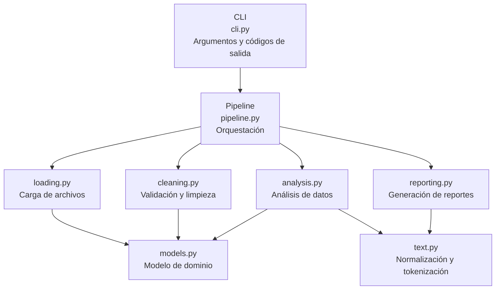
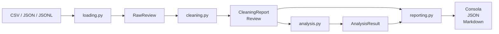
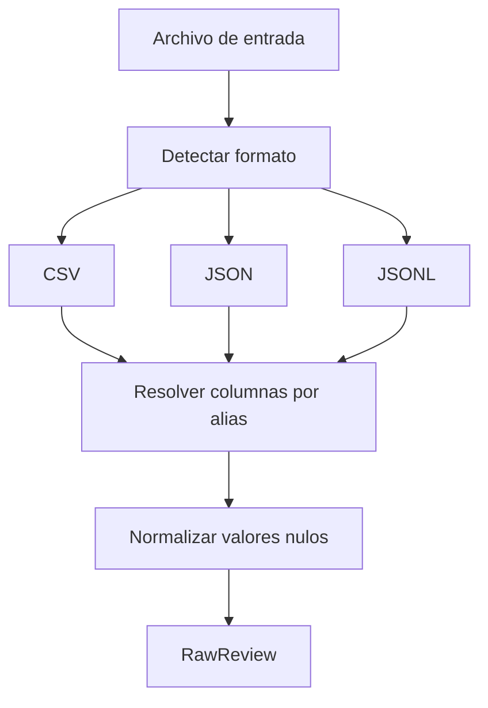
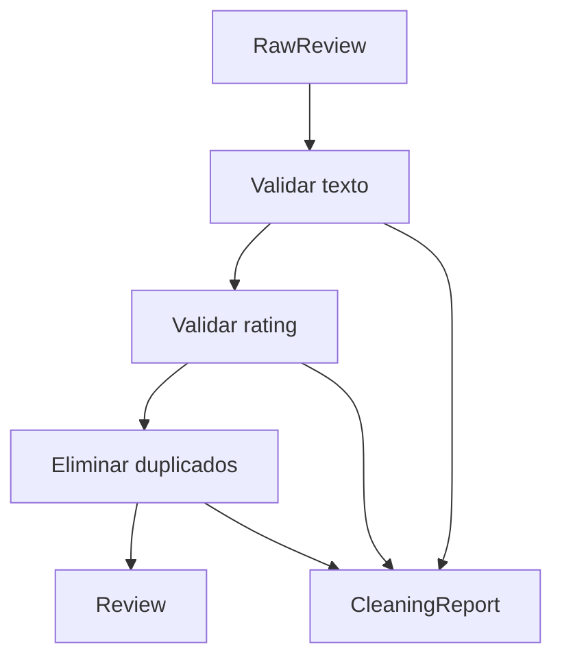
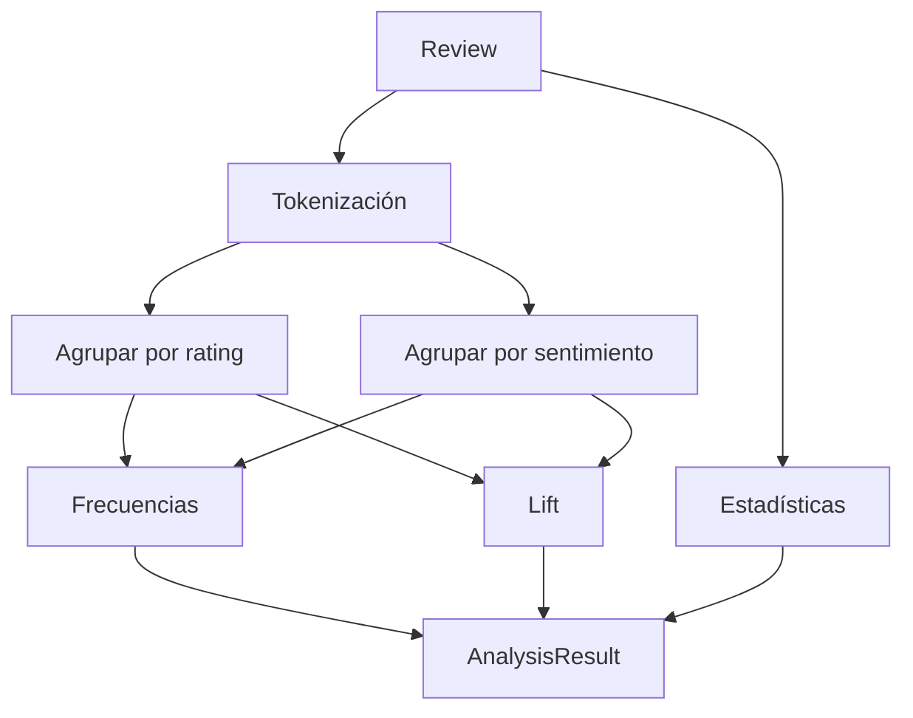

# Arquitectura

Este documento describe la organización del proyecto **flowapp-reviews**, el
flujo de procesamiento de los datos y la responsabilidad de cada módulo.

## Arquitectura por capas



### Regla de dependencias

Cada módulo depende únicamente de las capas inferiores.

- `analysis.py` trabaja únicamente con objetos del dominio (`Review`) y no
  conoce formatos de archivos.
- `reporting.py` recibe resultados del análisis y genera la salida sin conocer
  cómo fueron cargados los datos.
- `pipeline.py` es el encargado de coordinar todo el proceso.

---

## Flujo de procesamiento



---

## Proceso de carga (`loading.py`)



La carga realiza las siguientes tareas:

- Detecta el formato del archivo por su extensión.
- En CSV identifica automáticamente el delimitador.
- Resuelve nombres de columnas mediante alias.
- Convierte valores nulos (`null`, `NaN`, `N/A`, celdas vacías) en `None`.
- Numera las filas para facilitar el reporte de errores.

---

## Proceso de limpieza (`cleaning.py`)



Durante esta etapa:

- Se validan los textos.
- Se convierten y validan los ratings.
- Se eliminan duplicados exactos y normalizados.
- Cada rechazo queda registrado en el `CleaningReport`.

---

## Proceso de análisis (`analysis.py`)



El análisis calcula:

- palabras más frecuentes;
- palabras distintivas (*lift*);
- promedio y mediana del rating;
- distribución de calificaciones.

---

## Modelo de dominio

| Tipo | Responsabilidad |
| --- | --- |
| `RawReview` | Representa una fila cargada desde el archivo. |
| `Review` | Reseña validada e inmutable. |
| `Rejection` | Registro de una fila descartada. |
| `CleaningReport` | Resultado del proceso de limpieza. |
| `AnalysisResult` | Resultado completo del análisis. |
| `RejectionReason` | Motivos posibles de descarte. |
| `Sentiment` | Banda de sentimiento derivada del rating. |

---

## Códigos de salida

| Código | Significado |
| ---: | --- |
| `0` | Ejecución correcta. |
| `2` | Error de uso (argumentos o archivo). |
| `3` | Error en los datos de entrada. |

---

## Estructura del proyecto

```text
flowapp-reviews/
├── docs/
├── scripts/
├── src/flowapp_reviews/
├── tests/
├── data/
├── output/
├── pyproject.toml
├── Makefile
└── README.md
```

---

## Calidad

La verificación del proyecto se ejecuta mediante:

1. **ruff** para lint y estilo.
2. **mypy --strict** para comprobación de tipos.
3. **pytest** con cobertura de pruebas.

---

## Documentación relacionada

- [Architecture Decision Records](adr/README.md)
- [Guía de demostración](GUIA_DEMOSTRACION.md)